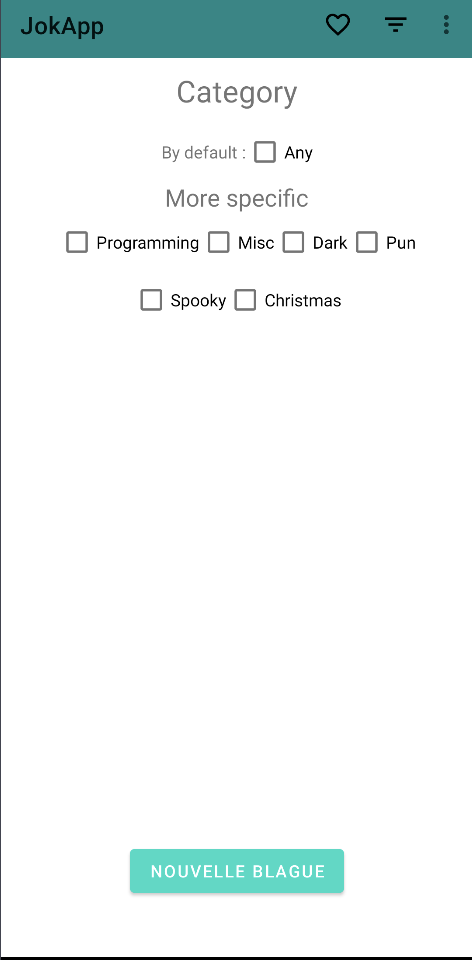
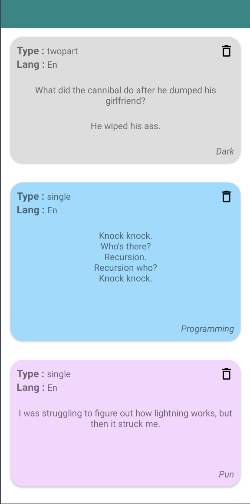

# JokApp

Application mobile permettant de **récupérer des blagues à partir de l'api [JokeApi](https://sv443.net/jokeapi/v2/)** suivant différents critères et de pouvoir, par la suite, les ajouters en favoris.

## Comment utiliser l'application

Une fois sur l'écran d'accueil, vous aurez accès à deux boutons :
- Générer blague -> Pour récupérer différentes blagues de l'api après sélection de filtres
- Favoris -> Accéder à ses blagues favorites

### Générer des blagues
---

La sélection des filtres se fera sur la première moitié de l'écran puis la blague s'affichera sur la deuxième moitié de l'écran après avoir cliqué sur le bouton *Nouvelle blague*.

Vous pourrez effectuer plusieurs actions à l'aide du menu situé en haut de votre écran. 
  - ♡ -> Ajouter au favoris
  - ⏚ -> Changer la sélection des filtres actuels à l'aide d'un sous menu

### Favoris
---

Vos favoris s'afficheront comme ci-dessus où chaque couleur représente une catégorie d'une blague. Vous pouvez les supprimer en cliquant sur la petite poubelle située sur la droite de la blague.

## Environnement technique
---

Pour lancer l'application il vous suffira de posséder **Android Studio**  avec **Jetpack** d'installé dessus. L'application a été développée avec une api minimum de 21 afin de pouvoir utiliser la bibliothèque Jetpack **Retrofit** permettant d'effectuer des requêtes réseaux.

De plus, l'application utilise d'autres bibliothèques Jetpack comme **Room** pour gérer la persistance des données au sein d'une base de données mais également des composants Jetpack comme le **View-Model**.

## Contributeur

Perret Louis, PM A1
